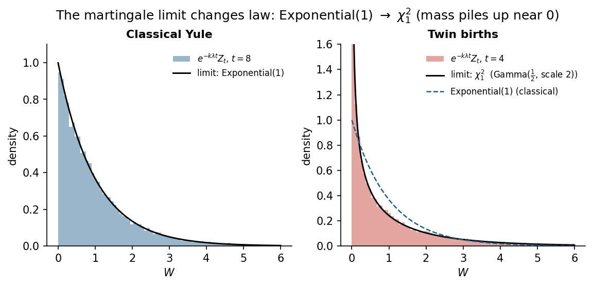

# yule-twins — the Yule process when individuals beget twins

Exact simulation, closed-form results and numerical checks for the Yule
process in which every individual, at rate λ, produces *k* children at once
(*k* = 1 classical, *k* = 2 twins). Prepared as a preliminary exploration for
the CIMPA Collaborative Workshop (Neuchâtel, January 2027), group of
Prof. Jean Bertoin.

**Main results** (derivations and checks in [`notes/note.md`](notes/note.md)):

| | classical (k=1) | twins (k=2) |
|---|---|---|
| law of Z_t | geometric(e^{-λt}) | 1 + 2N_t, N_t ~ NegBin(½, e^{-2λt}) |
| E[Z_t] | e^{λt} | e^{2λt} |
| martingale limit of e^{-kλt} Z_t | Exponential(1) | χ²₁ |
| leaf fraction of the genealogical tree | 1/2 | 2/3 |



## Reproduce

```bash
pip install -r requirements.txt
python run_all.py          # all figures + figures/summary.json, ~10 s
python -m pytest tests     # 6 checks: PGF solves the backward ODE, exact pmf,
                           # simulation vs theory, CI coverage, leaf fraction
```

## Layout

```
yule_twins/simulate.py   Gillespie simulation (single path / many paths at fixed t / until n births)
yule_twins/theory.py     PGF, exact pmf, moments, limit law
yule_twins/mle.py        maximum-likelihood rate estimation with an exact chi-square interval
yule_twins/trees.py      genealogical tree: growth, leaves, depths, degrees, radial layout
run_all.py               reproduces figures 1–5
notes/note.md            two-page research note
```

Figures: `fig1_paths` (sample paths and mean growth), `fig2_exact_law`
(negative-binomial law vs simulation), `fig3_martingale_limit`
(Exponential(1) → χ²₁), `fig4_mle` (rate estimation), `fig5_trees`
(genealogical trees, leaf fraction, depth profile, out-degree).

Author: Mateo Castañeda Cardona (Universidad Nacional de Colombia, Manizales). MIT licence.
